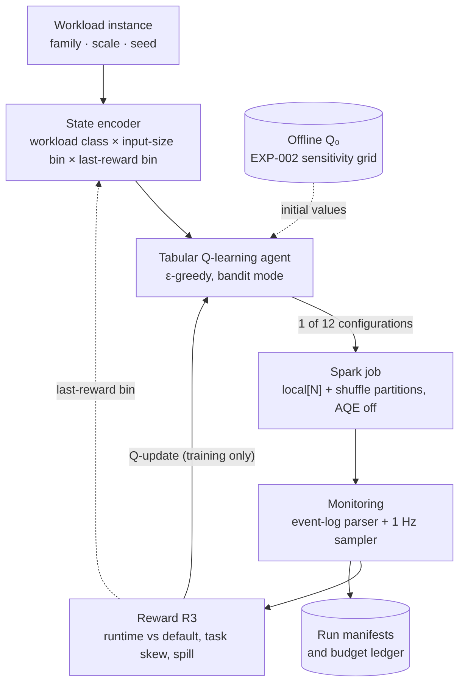

# AdaSpark

[](pyproject.toml)
[](requirements.txt)
[](docs/ENVIRONMENT_REPORT.md)
[](LICENSE)

**AdaSpark is a controlled, single-machine study of a small tabular reinforcement-learning (RL) controller
that picks one of 12 Apache Spark configurations for each job.**

Spark jobs usually run under one fixed configuration, although the best setting shifts with the operator
mix, data size and skew. AdaSpark wraps a monitor–analyze–plan–execute loop around Spark and asks three
questions: does such a controller beat Spark's defaults, does it beat competent static tuning, and does it
learn anything online? The study ran under pre-registered hypotheses, a sealed test split and an
append-only decision log, and reports its negative results next to its positive one. It is an M.Tech case
study.



**Contents:** [Key findings](#key-findings) · [Interpretation](#important-interpretation) ·
[How it works](#how-it-works) · [Results](#results) · [Limitations](#limitations) ·
[Quick start](#quick-start) · [Reproducing](#reproducing-the-research) · [Evidence](#research-evidence)

## Key findings

Verdicts are the project's own ([claim map](docs/research/CLAIM_EXPERIMENT_MAP.md)). † marks a finding of the
October 2026 review that awaits an owner decision ([docs/decisions/](docs/decisions/)). A *cell* is one frozen
test workload instance, and each comparison uses the median of 5 runs per method and cell. B0 is the
study's default baseline, B1 a static configuration chosen on validation data, B3 a rule heuristic, and B4
random search with the same budget.

| Question | Result | Status |
|---|---|---|
| Is the frozen policy faster than the default baseline B0? (H2) | About **4.0× faster**: runtime ratio 0.249 (95% CI 0.212–0.295); ≥10% faster on 36 of 37 cells; Holm p = 4.4×10⁻¹¹. This does not establish superiority over static tuning (next row) | ACCEPTED |
| Is it better than the heuristic and random search? (H3) | No, it is slower: RL/B3 = 1.22 (95% CI 1.13–1.32), RL/B4 = 1.21 (1.11–1.31). Both baselines pick the static configuration B1 on every test cell, so this is also RL against static tuning | REJECTED |
| Did online learning produce the test-time choices? | No. On 43 of 43 test cells the choice equals the offline initialization Q₀, or a tie-break for skew joins, which training never saw | NOT SUPPORTED † |
| Does the configuration matter on this hardware? (H1) | The 12 configurations move median runtime by ≥10%, beyond noise, on all 4 tested families | PASS (SC1) |
| Do independently trained policies agree? | On 1 of the 5 training states that all three seeds visited (0.20; target 0.70) | FAILED (M8) |
| Is monitoring overhead ≤5%? | 1 Hz sampler: yes on 6 of 7 cells in two studies. Spark event log: 3 PASS, 4 inconclusive | Sampler AFFIRMED · event log NOT RE-ESTABLISHED |
| Does the policy generalize to unseen workloads? (H4) | Not evaluable (no frozen seen-advantage baseline; 61 of 125 runs usable). One NYC Taxi month is a 20-run pilot | NOT EVALUABLE (SC5) |

## Important interpretation

> [!IMPORTANT]
> **Established:** under the frozen protocol, the policy's per-family configurations run about 4× faster
> than the study's default baseline B0: Spark's default 200 shuffle partitions, with the master pinned to
> `local[2]` (2 of the machine's 24 logical cores) and Adaptive Query Execution (AQE) off.
>
> **Not established:** that RL beats competent static tuning (a configuration chosen on validation data,
> `local[8]` with 16 partitions, was 1.22× faster overall); that online learning produced the gain (every
> test-time choice is Q₀, derived from a 208-attempt sensitivity grid outside the 500-execution training
> budget, or a tie-break, and the 232 training executions changed none of them); that the controller adapts
> at test time (evaluation used frozen decisions with no feedback history); that it beats Spark 3.x's own
> default, which has AQE on (AQE on was compared with B0 only); or that it generalizes.
>
> This study evaluates controlled single-node, local-mode Spark execution on one Windows 11 machine with
> inputs of at most about 0.4 GB. It does not establish performance on distributed production clusters.

## How it works

One *episode* is one Spark job under one configuration. During training the agent explores and updates its
Q-table after every run. For evaluation the table is frozen and the agent acts greedily from a no-history
state.

- **Action:** one of 12 predefined configurations: parallelism N ∈ {2, 4, 8} (`local[N]` with
  `spark.default.parallelism = N`) × `spark.sql.shuffle.partitions` ∈ {16, 32, 64, 128}. AQE is off, so the
  whole choice is made before the job starts. Memory, broadcast thresholds and caching are not tuned. The
  set was fixed in the plan, and the EXP-002 sensitivity gate showed that it matters (H1).
- **State:** workload class (5) × input-size bin (3) × whether the previous reward was positive (2), i.e.
  30 states. Every input in the study fell into the smallest size bin, so in practice the state is the
  workload class plus the feedback bit.
- **Learner:** tabular Q-learning as a contextual bandit (γ = 0), α = 0.2, ε-greedy from 1.0 to 0.05
  (×0.95 per episode), ties broken toward the lowest action index. Training-split executions are capped at
  500 (SC6).
- **Q₀:** before training, the no-history rows hold each configuration's median reward in the EXP-002 grid,
  measured on training data; pairs without evidence start at 0.5.
- **Reward (R3):** the runtime gain over the default configuration's time on the same workload instance,
  clipped to [−1, 1], plus a small bonus for balanced task durations and a penalty for disk spill. A failed
  or timed-out run scores −1.
- **Execution:** PySpark 3.5.9 in local mode on Java 17, with warm-up, per-run timeouts, Spark event logs
  parsed after each run and a 1 Hz psutil sampler during it.

What was built (code under [`src/sparkrl/`](src/sparkrl/)): the Spark runner, five workload families on
seeded synthetic Parquet data, the monitoring pipeline, the RL environment with split and budget guards, the
baseline strategies, resumable experiment drivers with dry-run modes, pre-registered analyzers (exact
Wilcoxon and Mann–Whitney tests, Cliff's δ, Holm correction, bootstrap CIs), 17 validators and a
reproducibility checker.

## Results

| Study | Question | Result | Status |
|---|---|---|---|
| [EXP-002](results/experiments/exp-002/analysis/summary.md) | Do the configurations move runtime ≥10%? | 4 of 4 tested families, beyond noise (208 attempts) | PASS (SC1) |
| [EXP-013](docs/research/DEC_053_EXP013_CONFIRMATORY_PREREGISTRATION.md), 42 test cells, 790 runs | H2: RL ≥10% faster than B0? | 0.249 (CI 0.212–0.295); 36/37 cells | ACCEPTED |
| EXP-013 | H3: RL better than B3 and B4? | 1.218 and 1.206; worse beyond noise on 16 cells (15 skew-join), better on 1 | REJECTED |
| EXP-013 | RL at least competitive with random search? | The interval crosses the noise band's edge | INCONCLUSIVE |
| EXP-013 | A/A control: do identical configurations agree? | Median gap 2.0%, 38/38 cells within ±11.89% | AFFIRMED |
| [Q₀ provenance](docs/decisions/D-NEW-01_q0_test_time_provenance.md) (0 Spark) | Are test-time choices learned online? | 43/43 cells = offline Q₀ or tie-break | NOT SUPPORTED † |
| [EXP-004](docs/research/DAY29_TRAINING_REPLICATES_AND_M8_AUDIT.md) | Do three training seeds agree? | 0.20 against a 0.70 target | FAILED (M8) |
| [EXP-006](docs/research/DAY35_EXP006_ANALYSIS.md) | Generalization to unseen cells | 61/125 runs usable; no frozen baseline | NOT EVALUABLE (SC5) |
| [EXP-007/008](docs/research/DAY36_EXP007_ANALYSIS.md) | State, reward and action ablations | State effect confounded with Q₀; reward/action derived, not trained; multi-step not run | OBSERVED · DERIVED ONLY · NOT RUN |
| [EXP-009](docs/research/DAY39_DEC043_EXP009_STAGES_1_7_EXECUTION.md) / [EXP-014](docs/research/DEC_054_EXP014_OVERHEAD_CONFIRMATION.md) | Monitoring overhead ≤5%? | Sampler 6/7 in both; event log 3/7 PASS, 4 inconclusive | Sampler AFFIRMED · event log NOT RE-ESTABLISHED |
| [X6](results/evaluation/x6_b0prime_analysis.json) → EXP-013 | AQE-on complement: does AQE on beat B0? | X6's −14.24% lead did not recur interleaved (0/6 cells) | NOT REPLICATED |
| [X9](results/evaluation/x9_taxi_analysis.json) | Real data (one NYC Taxi month) | Tuned configuration −78% / −70% vs B0; RL by identity only | FEASIBILITY (pilot) |
| [X10](results/evaluation/x10_sc7_analysis.json), EXP-013 | Re-runs within ±5%? | 2/4; 18/39 | PARTIAL (SC7) |
| [Budget ledger](docs/REPRODUCE.md#execution-accounting-the-500-execution-budget-versus-the-whole-study) | Training-split runs ≤500? | 483 charged (232 policy training); 488 with the demo | HOLDS (SC6 budget clause) |

A side finding: repeated runs on one machine were serially correlated (lag-1 autocorrelation +0.58 to
+0.89), which falsified the standard √n repetition model on 7 of 7 cells; in hindsight about 3,000 of 4,842
runs were not needed ([paper draft](docs/report/PAPER_DRAFT_monitoring_overhead.md)).

## Limitations

- **Defaults, not tuning:** the policy is 1.22× slower than static tuning, almost entirely on skew joins,
  where its choice is an untrained tie-break.
- **No measured learning effect:** online training changed no test-time choice; adaptation was never
  evaluated; all inputs fall in one size bin; the seeds agree on 0.20 of shared states. A learning-effect
  experiment is designed but not run ([D-NEW-02](docs/decisions/D-NEW-02_learning_effect_and_baseline_experiments.md)).
- **AQE and generalization:** AQE is off in the main study so that the choice precedes execution. The AQE-on
  complement was compared with B0 only, and its earlier lead did not replicate. Generalization is not
  established; the real-data evidence is a 20-run pilot.
- **Windows-specific failures:** `F3_rdd` at large scale fails under every configuration tried
  (`WinError 32`); on one medium cell the policy's choice failed where static baselines succeeded.
- **Scope:** one machine, local mode, synthetic inputs of at most about 0.4 GB, 12 predefined
  configurations; no clusters, no deep RL.
- **Governance and reproducibility:** pre-registration was internal (committed before each run;
  counter-signatures pending), and some records disagree with the repository pending owner decisions
  ([docs/decisions/](docs/decisions/)). The raw records await an archival deposit, so most results can be
  integrity-checked but not re-derived from a fresh clone.

## Quick start

Tested on Windows 11 only. Prerequisites:

- Python 3.11 and Git;
- Java 17 with `JAVA_HOME` set;
- the Hadoop 3.3.6 Windows binaries (`winutils.exe`, `hadoop.dll`) in a `bin` folder, with `HADOOP_HOME`
  set to its parent and that `bin` folder on `PATH` (the study used the community `cdarlint/winutils`
  build; the project recorded Spark failures without it, DEC-006);
- about 1.2 GiB of free disk for the demo dataset.

```powershell
git clone https://github.com/prakharagrawal191/AdaSpark.git
cd AdaSpark
py -3.11 -m venv "$env:USERPROFILE\sparkrl_env311"         # keep the venv outside the clone if it is in a synced folder
& "$env:USERPROFILE\sparkrl_env311\Scripts\Activate.ps1"    # if blocked: Set-ExecutionPolicy -Scope Process RemoteSigned
pip install -r requirements.txt
pip install -e . --no-deps

python -m pytest tests                                      # expect 0 failed; data-gated tests skip and say why
python scripts/verify_reproducibility.py --integrity-only   # committed results are intact (0 Spark)

python scripts/generate_dataset_matrix.py --scale small --seed 0 --skew 1.0   # one ~40 MB dataset, a few minutes
python scripts/run_workload.py --family F5_mixed --scale small --seed 0       # one run under the default settings
python scripts/demo.py --mode live --allow-spark                              # B0, B3, then 3 episodes of the frozen policy
```

On a fresh clone 38 data-gated tests skip (17 need the raw research records, 21 the full dataset matrix).
The demo prints configuration, runtime and reward per run. Episode 1 uses Q₀; after a positive reward,
later episodes use the feedback state that training updated. Delete `results/experiments/x-demo/` to
repeat it. Datasets go to `data/generated/` (or `$SPARKRL_DATA_ROOT`), Spark event logs to
`%USERPROFILE%\sparkrl_data\`. `python scripts/env_check.py` diagnoses Java, Hadoop and Spark without
overwriting the committed report. These runs demonstrate the loop; they do not reproduce or add to the
research results.

## Reproducing the research

Full reproduction is not one command. [`docs/REPRODUCE.md`](docs/REPRODUCE.md) separates **integrity checks**
(any clone, seconds), **re-derivation** (needs the raw records, minutes, 0 Spark) and **re-execution** (hours
of Spark time per study). It lists each study's status, seeds, frozen fingerprints, and the accounting of
the 500-execution budget against the roughly 7,400 runs of the whole study.

## Repository structure

```text
src/sparkrl/         the package: spark, workloads, datagen, monitoring, rl, agent, training, evaluation, analysis
scripts/             drivers (run_*), analyzers (analyze_*), validators (validate_*), demo, checks
configs/             frozen Spark, RL, reward and baseline settings
models/policies/     the three frozen trained policies (JSON Q-tables)
results/evaluation/  committed analysis outputs (raw records are git-ignored, pending deposit)
tests/               unit/ (default), integration/ (live Spark, opt-in)
docs/                PLAN.md, REPRODUCE.md, PROJECT_HISTORY.md, decisions/, research/
manuscript/          case-study report sources and dataset manifests
DECISIONS.md         append-only decision log (DEC-001 to DEC-055)
```

## Research evidence

- [`docs/PLAN.md`](docs/PLAN.md): the frozen plan, with hypotheses H1–H4 and success criteria SC1–SC8.
- [`docs/research/CLAIM_EXPERIMENT_MAP.md`](docs/research/CLAIM_EXPERIMENT_MAP.md): every claim with its evidence and status.
- [`DECISIONS.md`](DECISIONS.md): the decision log; [`docs/PROJECT_HISTORY.md`](docs/PROJECT_HISTORY.md) indexes it and
  holds the day-by-day history and compute accounting.
- [`docs/decisions/`](docs/decisions/): open owner decisions from the October 2026 review, with evidence.
- [`docs/research/NOVELTY_POSITIONING.md`](docs/research/NOVELTY_POSITIONING.md): closest prior work, what is new, and what not to claim.
- [`docs/REPRODUCE.md`](docs/REPRODUCE.md): how to reproduce, by tier and by study.
- [`results/evaluation/`](results/evaluation/), [`manuscript/`](manuscript/), [`docs/COMMIT_ID_MAP.md`](docs/COMMIT_ID_MAP.md).

## License

Apache License 2.0; see [`LICENSE`](LICENSE). Author and maintainer:
[@prakharagrawal191](https://github.com/prakharagrawal191).
