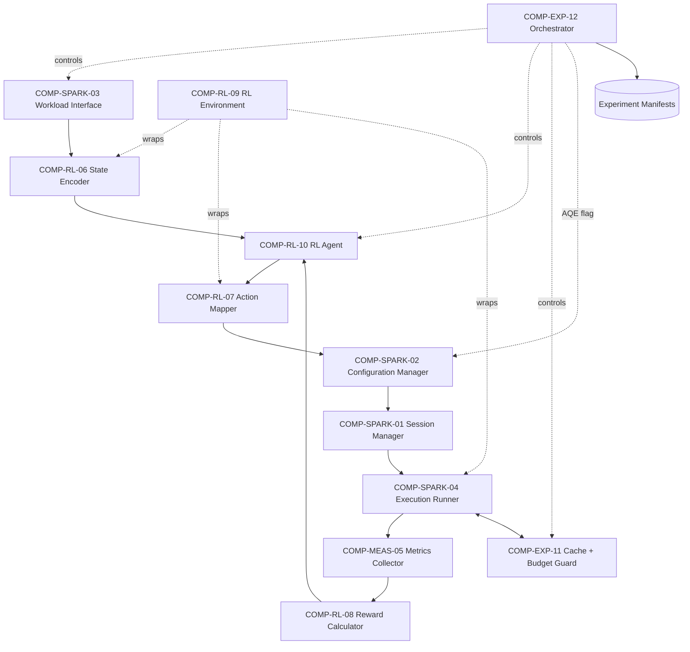
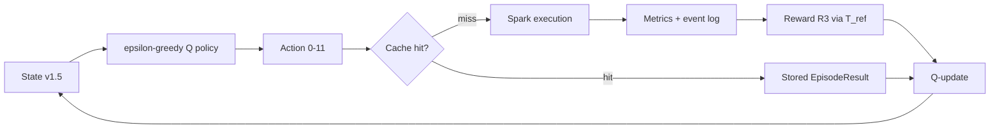
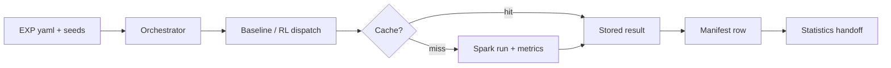
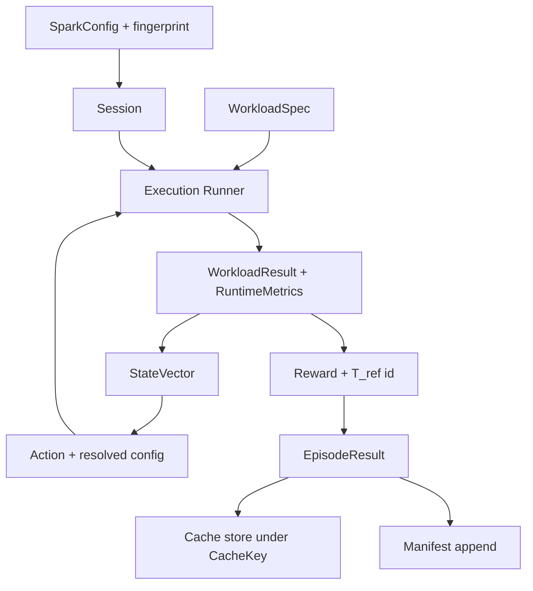
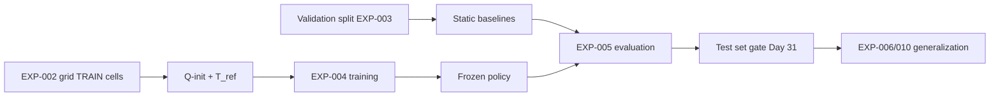
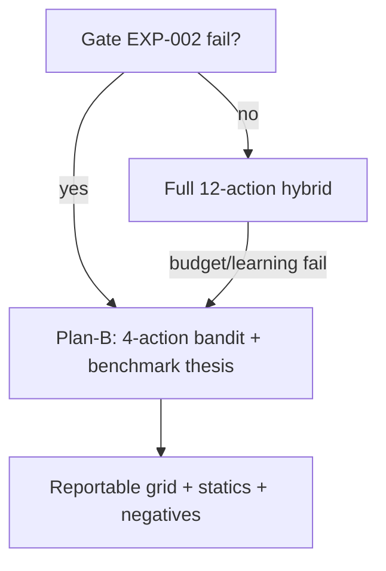

# AdaSpark Architecture Freeze — Candidate C

*Day 12 · Status: ARCHITECTURE FROZEN FOR IMPLEMENTATION (pending acceptance gate) · Selected: Candidate C — Hybrid offline-init + bounded online adapt + cache (DEC-008) · Sources: PLAN §§2,5-7,11,20-23,31,33,38-39,44; RESEARCH_PROBLEM; GAP; NOVELTY_TIERING; ARCHITECTURE_CANDIDATES; registry.csv · Foundation reused: src/sparkrl/spark/{config,session,runner}.py, workloads/baseline.py, utils/paths.py, configs/spark.yaml*

> Design decision, NOT an empirical result. The architecture is designed to evaluate whether bounded hybrid RL improves Spark execution time. No RL implementation exists yet; performance is decided by EXP-004/005.

## 1. Architecture Status

Candidate C provisionally selected Day 11 (DEC-008) is hereby frozen as the implementation blueprint. Day-12 answers all §12 open questions (Q-table schema, cache keys, v1.5 state spec, 12-action table shape, R3 inputs, guard/cache interplay, AQE surface, manifest formats, seed + test-guard). Component contracts live in COMPONENT_CONTRACTS.md; checklist in ARCHITECTURE_CHECKLIST.md; decision in DEC-009.

## 2. Selected Architecture

Hybrid offline-init + bounded online adaptation + cache. EXP-002 grid calibrates T_ref and pre-initializes Q; epsilon-greedy tabular Q-learning adapts online within ≤500 cached executions; execution cache returns stored results for repeated (workload, seed, config, code-version, env-version) keys; AQE-off main study, AQE-on EXP-005b; frozen unseen test set until Day 31.

## 3. Design Goals

G1 Answer every frozen EXP unchanged (RQ0–RQ6, H1–H4, SC1–SC8). G2 Enforce ≤500 cached executions structurally. G3 Calibrate before learning (no reward without T_ref). G4 Separate concerns: Spark execution / measurement / state / policy / learning / orchestration. G5 Reuse Day-3 foundation, no duplicate harness. G6 Full provenance (manifest per run, fingerprint per config, version per policy). G7 Plan-B without rewrite. G8 Single-node, no new infrastructure.

## 4. Architectural Invariants

Single-node local mode (DEC-007) · seeds + manifests reproducible · configuration-driven, no hard-coded hyperparameters · measurable state · bounded 12-action space · T_ref-calibrated reward · budget guard ≤500 · deterministic cacheability · identical-protocol baselines · AQE off main / on 005b · test set frozen to Day 31 · ±5% re-run · green tests · Plan-B recoverable · no cluster/K8s/cloud/microservices, no deep RL, no GPU in Spark path.
## 5. Component Inventory (12 frozen components)

20 candidates evaluated (Step 3 list). Consolidated: Event-Log Parser folds into Runtime Metrics Collector (one measurement path); Workload Context Extractor folds into State Encoder (context is state-construction input); Policy/Model Store folds into RL Agent (Q-table ownership); Result/Manifest Writer folds into Experiment Orchestrator (single provenance writer); Seed Controller folds into Orchestrator (single RNG authority). Session/Config/Runner stay separate (exist, tested Day 3). Final 12:

| ID | Component | Maps to Day-3 / future code |
|---|---|---|
| COMP-SPARK-01 | Session Manager | spark/session.py (exists) |
| COMP-SPARK-02 | Configuration Manager | spark/config.py + configs/spark.yaml (exists) |
| COMP-SPARK-03 | Workload Interface | workloads/* (baseline.py exists; families Day 14+) |
| COMP-SPARK-04 | Execution Runner | spark/runner.py (exists) |
| COMP-MEAS-05 | Metrics Collector (incl. event-log parsing) | monitoring/* (Day 18+) |
| COMP-RL-06 | State Encoder (incl. context extraction) | env/state (Day 22+) |
| COMP-RL-07 | Action Mapper (12-action space) | env/action (Day 22+) |
| COMP-RL-08 | Reward Calculator (R3 primary) | env/reward (Day 22+) |
| COMP-RL-09 | RL Environment (Gymnasium-style step) | env/* (Day 25) |
| COMP-RL-10 | RL Agent (tabular Q + policy store) | agent/* (Day 26+) |
| COMP-EXP-11 | Experiment Cache + Budget Guard | optimization/cache (Day 20) |
| COMP-EXP-12 | Experiment Orchestrator (baselines, AQE control, seeds, manifests, evaluation) | optimization/runner + analysis/* (Days 20/39+) |

Each component's Responsibility/Inputs/Outputs/Dependencies/Configuration/Failure/Logging/Test/Research-role contract is in COMPONENT_CONTRACTS.md §2.
## 6. Component Contracts (summary; full text in COMPONENT_CONTRACTS.md)

COMP-SPARK-01 Session Manager: validated local-mode sessions from SparkConfig; version-checked (3.5 prefix); explicit startup error, no silent fallback. COMP-SPARK-02 Configuration Manager: YAML/dict → validated SparkConfig; fingerprint; AQE flag; rejects unknown knobs. COMP-SPARK-03 Workload Interface: deterministic run(spark, config) → WorkloadResult + reference_check; per-family seeds. COMP-SPARK-04 Execution Runner: warmup → timed run → timeout-cancel → RunResult; timed region excludes session/warmup. COMP-MEAS-05 Metrics Collector: wall-clock + event-log parse → RuntimeMetrics; missing-log fallback to wall-clock only, flagged. COMP-RL-06 State Encoder: workload context + runtime feedback → versioned StateVector (v1.5 frozen fields; context-only variant = ablation A1). COMP-RL-07 Action Mapper: discrete index ↔ 12 SparkConf deltas; validates against allowlist; Plan-B 4-action subset is indices {0,3,6,9} of the same table. COMP-RL-08 Reward Calculator: R3 = R2 + efficiency terms from T_ref-normalized time; needs T_ref store; failed runs → error path, never a numeric reward. COMP-RL-09 RL Environment: reset/step(seed) with budget + cache + leakage guards; no test-split access before Day 31. COMP-RL-10 RL Agent: epsilon-greedy tabular Q (α, γ, ε from RL config, no hard-coding); Q-init load/save with version; update failures abort episode, never corrupt Q silently. COMP-EXP-11 Cache + Guard: deterministic key lookup; hit returns stored result without Spark; miss executes once then stores; counter enforces ≤500; corruption → quarantine + miss. COMP-EXP-12 Orchestrator: owns seeds, baseline dispatch (B0/B0′/B1–B4/RL identical protocol), AQE flag, manifests, train/val/test gating, statistics handoff.

## 7. Data Contracts (summary; field tables in COMPONENT_CONTRACTS.md §4)

SparkConfig (frozen dataclass + fingerprint) · WorkloadSpec (family/scale/seed/AQE flag/test-split tag) · WorkloadResult (checksum + measurements) · RuntimeMetrics (exec_s, task-imbalance, spill bytes, overhead_s, log provenance) · StateVector (v1.5 fields + schema version) · Action (index 0–11 + resolved SparkConf deltas + fingerprint) · Reward (R2, efficiency terms, R3 total, T_ref id) · EpisodeResult (state, action, reward, metrics, cache-hit flag) · ExperimentManifest (EXP id, seeds, fingerprints, AQE mode, policy version, results table) · CacheKey (workload, seed, config fingerprint, code version, env version) · BaselineResult (strategy id + manifest ref) · EvaluationResult (medians, Wilcoxon/Cliff/Holm outputs, figure refs). JSON-serializable; seconds SI; bytes int; determinism: same key → same stored result.
## 8. Configuration Contract

Three layers, precedence experiment > system defaults, all versioned into manifests. SYSTEM (configs/spark.yaml → SparkConfig): master/app/driver-memory/UI/event-log dirs/version prefix/AQE default/shuffle default. EXPERIMENT (experiments/<EXP>.yaml): workload family/scale/seed set, action-subset selector (12/4), AQE mode, split tag (train/val/test), repetition count (5), timeout factor. RL (rl.yaml): state schema version (v1.5), action-space id, reward variant (R2/R3/R4), α/γ/ε schedule, budget cap (≤500), Q-init ref, ablation selector (A1–A5). No hyperparameter hard-coded; unknown keys rejected; every run logs resolved configs + fingerprints.

## 9. RL Contract

State: frozen v1.5 (workload context: family id, scale, skew flag, operator mix; runtime feedback: prev exec-time ratio, task-imbalance, spill bytes; all normalized; schema versioned). Ablation A1 = context-only, A2 = full v1.5. Action: 12 discrete configs (parallelism × shuffle-partitions × cache-strategy cells; exact table Day 22 within PLAN §21 dimension bounds; Plan-B subset = 4 anchor cells). Reward: R2 = clip((T_ref−T)/T_ref) primary; R3 = R2 + efficiency terms (imbalance/spill penalties, weights in rl.yaml); R4 = −ln(T/T_ref) ablation-only. T_ref per (workload, scale) from EXP-002 medians; frozen before EXP-004. Episode: one cached-or-live execution + update. Policy: epsilon-greedy over Q (ties → lowest action index; seeded RNG). Exploration: ε schedule in rl.yaml, decayed on cached-or-live steps. Learning: tabular Q-update with α/γ from config; failed runs skip update. Budget: counter increments on live executions only; cache hits free; hard stop at 500 (SC6). Initialization: per-(context-bucket, action) Q seeded from grid-cell normalized gains, versioned q-init/<date>-exp002; unmeasured cells → 0.
## 10. Offline Initialization Contract

Grid (EXP-002) emits per-(family, scale, action) median times + T_ref table (default-config medians). Safe-for-init subset: TRAIN-split cells only; validation cells calibrate baselines (EXP-003); test cells never touched. Init builder maps grid gains → Q-init values, stamps (grid manifest id, code version); Orchestrator refuses Q-init built from test-tagged data (leakage guard) and refuses training before T_ref exists. Test set stays untouched until Day 31 (registry + orchestrator gate).

## 11. Cache Contract

Key = (workload_id, seed, config_fingerprint, code_version, env_version[spark/python/java]). Hit: return stored EpisodeResult bytes unchanged, flag cache_hit=true, no Spark execution, no budget increment. Miss: execute once via COMP-SPARK-04, store on success; failures stored as failure records (never returned as success). Invalidation: any key-component change → automatic miss (no manual purge). Corrupt entry (hash mismatch / schema fail) → quarantine + treat as miss + log. Partial runs (timeout/cancel-late) → failure records. Concurrent access: single-writer file lock; readers never block on partial writes. Failed configs MUST NOT yield positive reward (error path, Q-update skipped).

## 12. Baseline Contract

Interface BaselineStrategy.select(state) + id + describe; harness executes every strategy (B0 default, B0′ static-tuned EXP-003, B1/B2 family/scale-tuned, B3 rule heuristic, B4 equal-budget random, RL frozen policy) with identical workload/seed/config-boundary/measurement/manifest schema. Random strategies draw from the Orchestrator RNG stream (seeded, logged). No strategy touches test data before Day 31.
## 13. AQE Contract

AQE is an experimental control owned by COMP-EXP-12, applied via COMP-SPARK-02 flag (spark.sql.adaptive.enabled + spark.yaml aqe_enabled). Main study: OFF (PLAN §7). EXP-005b: ON with identical workloads/seeds/actions otherwise. Every manifest records aqe_mode; analysis never pools across modes. No code changes per mode — flag only.

## 14. Training/Validation/Test Boundary

TRAIN: policy learning (EXP-004) + grid-init source cells. VALIDATION: baseline calibration (EXP-003), gate checks, ablation selection. TEST: frozen set, unseen families/scales/seeds + Taxi (EXP-010); access gate: Orchestrator split-tag enforcement + registry status + Day-31 date check; any pre-Day-31 test-tagged read aborts the run loudly. Frozen policies evaluated once on test (EXP-005/006).

## 15. Failure and Recovery

Startup fail → abort run, manifest error, no retry loop. Workload fail → RunResult success=false, reward path skipped, cache stores failure record. Timeout → cancelJobGroup + grace; late thread flagged daemon, never blocks exit (Day-3 semantics preserved). Metrics/log fail → wall-clock-only metrics + provenance flag; abort only if wall-clock missing. Invalid action/config → rejected pre-execution, manifest error. Cache corruption → quarantine + miss. RL update fail → episode aborted, Q untouched, run logged. Reward fail (no T_ref) → hard error: training cannot start uncalibrated. Failed Spark configs never produce positive reward (invariant F-FAIL).
## 16. Plan-B Architecture

FULL: 12-action hybrid (this freeze). PLAN-B (pre-authorized §39 tier 3): 4-action anchor subset + bandit-mode agent (γ=0 equivalent, no multi-step) + benchmark framing; multi-step mode, LinUCB, ablations A2/A4/A5 droppable via config selectors only — same components, same manifests, no rewrite. Grid + static/rule/random evidence from EXP-002/003/005 stands alone as the sensitivity/benchmark thesis.

## 17. Experiment Compatibility

| EXP | Components involved | Supported unchanged? |
|---|---|---|
| 001 noise calib | 01,02,03,04,05,12 | Yes — runner + metrics only |
| 002 sensitivity grid | 01,02,03,04,05,07,11,12 | Yes — grid IS the init source; gate + T_ref + Q-init |
| 003 static calib | 02,03,04,12 | Yes — validation-split statics (B0′/B1/B2) |
| 004 RL training | 06,07,08,09,10,11,12 (+01–05) | Yes — ≤500 cached, seeded, T_ref-gated |
| 005 main comparison | all 12 | Yes — 5–7 arms, 5 seeds, Wilcoxon/Cliff/Holm handoff |
| 005b AQE-on | 02,12 (+all exec) | Yes — flag-only mode split |
| 006 generalization | 10,12 (+03) | Yes — frozen policy, unseen tags |
| 007 A1/A2 | 06,09,10,12 | Yes — state-schema selector |
| 008 A3–A5 | 07,08,09,10,12 | Yes — reward/action/gamma selectors |
| 009 overhead | 05,11,12 | Yes — overhead_s measured both modes |
| 010 Taxi | 03,10,12 | Yes — external workload via same interface |
| 011 repro | 12,11 | Yes — manifest replay within ±5% |
| 012 demo | 12 (+frozen policy) | Yes — fixed-seed run-book |

## 18. Diagrams

Mermaid sources below (§18.1–18.6); render with `npx @mermaid-js/mermaid-cli -i <src> -o docs/architecture/figures/<name>.svg` (no repo infrastructure added; figures/ optional, sources authoritative).
### 18.1 High-level system architecture

### 18.2 Training / adaptation loop

### 18.3 Experiment execution pipeline

### 18.4 Data / control flow

### 18.5 Train → validation → test boundary

### 18.6 Plan-B fallback path

## 19. Technology Mapping

Single-node PySpark 3.5.9 / Python 3.11.9 / Java 17 / winutils (DEC-007) · Gymnasium-style env (interface only, Day 25) · JSON manifests + SHA-256 fingerprints · file-lock cache · Wilcoxon/Cliff's δ/Holm in analysis (Day 39+) · Mermaid sources in-doc, optional SVG via mermaid-cli (no repo dep). No Docker/K8s/cloud/microservices, no DQN/PPO (excluded §27), no GPU in Spark path.

## 20. Architecture Acceptance Checklist

[ ] Candidate C frozen (this doc + DEC-009) · [x] boundaries (§5) · [x] interfaces (§6/CONTRACTS §3) · [x] data (§7/CONTRACTS §4) · [x] config flow (§8) · [x] state/action/reward (§9) · [x] cache (§11) · [x] offline init (§10) · [x] train/val/test (§14) · [x] baselines (§12) · [x] AQE (§13) · [x] failure/recovery (§15) · [x] Plan B (§16) · [x] EXP matrix (§17) · [x] 6 diagrams (§18.1–18.6) · [x] no new infra · [x] no new RQ/H/SC/EXP · [x] no implementation.

## Design audit (Step 26, recorded)

1 Every EXP executable unchanged (§17). 2 Plan B = config selectors, no redesign (§16). 3 RL loop (06–10) separated from Spark execution (01–04) via env boundary (09). 4 Cache (11) separated from learning (10): hits return data, never update Q directly. 5 AQE is a flag-controlled arm, never ambient. 6 Failed vs low-reward distinguished structurally (error path vs numeric reward; F-FAIL). 7 Leakage prevented (split tags + Q-init provenance + Day-31 gate). 8 Every result → manifest row; every policy versioned. 9 Incremental from Day 13 (session/config/runner exist; order: cache → workloads → monitoring → env → agent). 10 Needed: 12 kept, 8 folded; nothing decorative. Verdict: FIT FOR FREEZE.

## Superseded on one point — DEC-010 (2026-09-12)

§11 "Learning: … failed runs skip update" and §12 "error path, Q-update
skipped" are SUPERSEDED by **DEC-010**. A failed or timed-out episode is a
first-class observation: reward −1 (the frozen R3 failure term) and the Q-update
IS applied. `docs/PLAN.md` governs where a derived Day-12 document contradicts
it; DEC-010 records that precedence rule, which was previously undocumented.
The text above is retained unaltered as the frozen record of what Day 12
decided. The F-FAIL invariant is unaffected: it constrains the reward's SIGN
(never positive on failure), not whether the observation trains.
